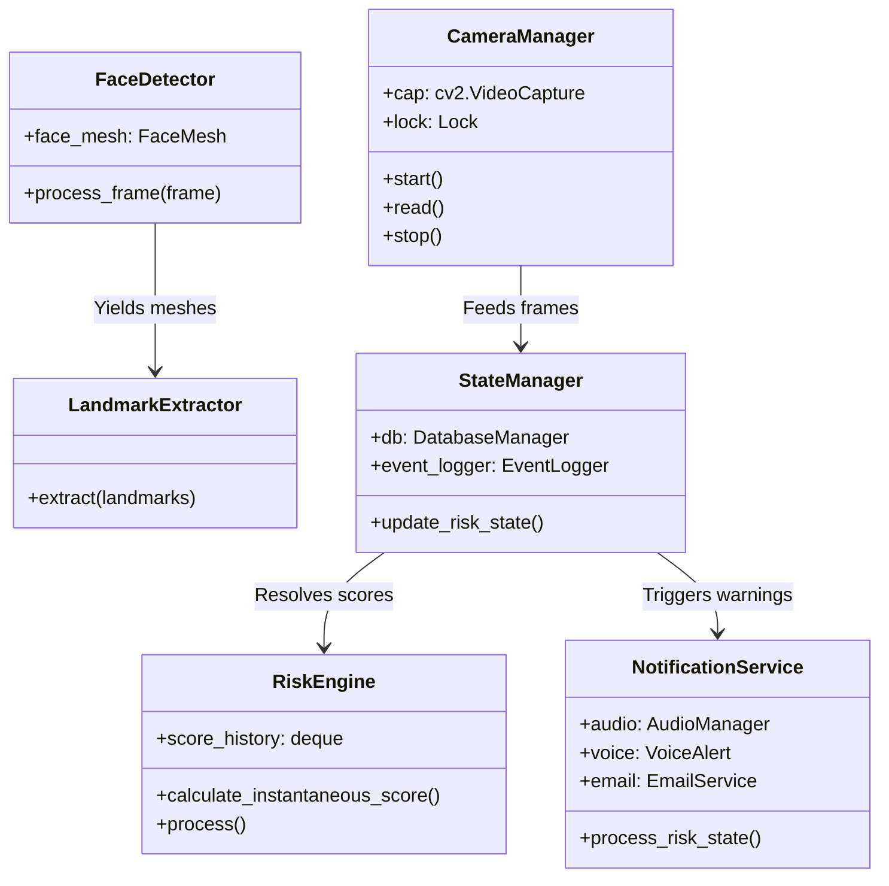

# System Architecture & Design Specification

This document details the software architecture, design patterns, and SOLID design principles used in the **AI-Powered Intelligent Driver Safety & Drowsiness Prevention System**.

---

## 🏗️ Layered System Architecture

The application is structured into five distinct abstraction layers, separating user interfaces, business logic, data persistence, and alert hardware controllers.

```
┌──────────────────────────────────────────────────────────┐
│              Presentation Layer (UI / CLI)               │
│         st.dashboard.py  <──>  cli_runner.py             │
└────────────────────────────┬─────────────────────────────┘
                             │ Uses
┌────────────────────────────▼─────────────────────────────┐
│             Orchestration & State Layer                  │
│       state_manager.py  <──>  notification_service.py    │
└────────────────────────────┬─────────────────────────────┘
                             ├──────────────────────┐
                             │ Uses                 │ Uses
┌────────────────────────────▼────────────────┐     ┌──────▼──────────────────────┐
│           Core CV & ML Engine               │     │      Infra & Alert Layer    │
│  detector.py     <──> landmark_extractor.py │     │  audio_manager.py (pygame)  │
│  metrics.py      <──> head_pose_detector.py │     │  voice_alert.py (pyttsx3)   │
│  fatigue_predictor.py (Scikit-Learn ML)     │     │  email_service.py (SMTP)    │
└────────────────────────────┬────────────────┘     └─────────────────────────────┘
                             │ Saves
┌────────────────────────────▼─────────────────────────────┐
│             Persistence & Storage Layer                  │
│          database_manager.py  <──>  event_logger.py      │
└──────────────────────────────────────────────────────────┘
```

---

## 🧩 Architectural Design Patterns

To maintain a clean and modular codebase suitable for academic evaluation and open-source release, the system implements several software design patterns:

### 1. The Facade Pattern (`StateManager`)
* **Problem**: The presentation layer (Streamlit/CLI) needs to interact with many modules (SQLite DB, event loggers, configuration parameters, and alert notifications). Direct imports would create tight coupling.
* **Solution**: `StateManager` acts as a facade. The UI invokes `start_session()`, `end_session()`, and `update_risk_state()`, and the manager internally handles updates to user profiles, database queries, and notifications.

### 2. The Repository Pattern (`EventLogger`)
* **Problem**: Mixing SQL query structures with business logic violates the Single Responsibility Principle.
* **Solution**: `EventLogger` isolates all database operations (starts, endings, logging, and incrementing stats) from the rest of the application.

### 3. Asynchronous Producer-Consumer Pattern (`VoiceAlert` & `EmailService`)
* **Problem**: Speech synthesis (`pyttsx3`) and SMTP handshakes block execution on the main thread, dropping webcam processing rates.
* **Solution**: Background worker threads pull from thread-safe queues. The main loop pushes commands to the queue in 1ms, while the background thread handles blocking I/O asynchronously.

---

## 🛡️ SOLID Principles Compliance

* **Single Responsibility Principle (S)**:
  * `CameraManager` grabs frames.
  * `FaceDetector` wraps MediaPipe.
  * `RiskEngine` calculates numerical scores.
  * `AudioManager` outputs WAV bleeps.
* **Open/Closed Principle (O)**:
  * CV detectors inherit from configuration models. You can add new threshold algorithms (e.g., heart rate monitors or steering wheel deflection trackers) without modifying existing detectors.
* **Liskov Substitution Principle (L)**:
  * All persistency structures communicate via the `DatabaseManager` connection interface.
* **Interface Segregation Principle (I)**:
  * The GUI reads only what it needs for rendering. State updates are pushed separately.
* **Dependency Inversion Principle (D)**:
  * Standard properties (such as thresholds and database paths) are not hardcoded inside CV modules. They are injected from the unified `config.py` instance.

---

## 📊 Class Relationships (UML Diagram)


